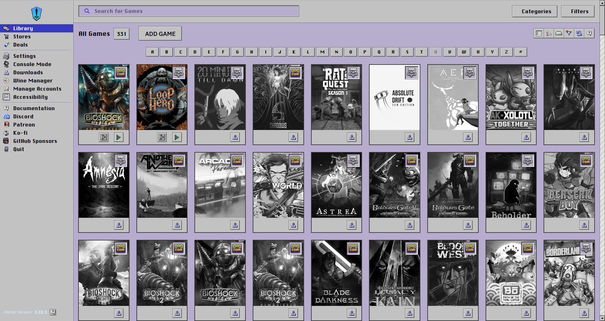
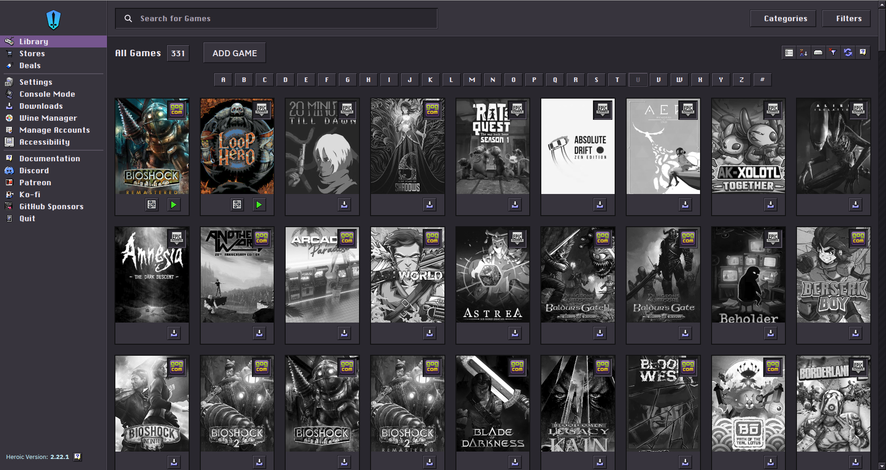

# macOS 9 Inspired Theme for Heroic

[Polska wersja README](README.pl.md)

A self-contained, unminified custom theme that brings a Mac OS 9 / Platinum-inspired interface to Heroic Games Launcher. It includes coordinated light and dark variants, classic controls, custom icons and deliberately square geometry.

> Theme version: **1.0**  
> Verified target: **Heroic Games Launcher 2.22.x**

| Light                                                       | Dark                                                      |
| ----------------------------------------------------------- | --------------------------------------------------------- |
|  |  |

The images above are unmodified screenshots of the actual Heroic Library running the supplied light and dark theme variants.

## Highlights

- Platinum-style raised and sunken controls;
- coordinated light and dark palettes;
- classic iconography across Library, game details, settings and Wine Manager;
- historical-looking but readable GOG, Epic Games and Amazon store marks;
- consistent square checkboxes and checkmarks;
- fixed 17 px scrollbars with square arrow buttons and a stationary patterned track;
- embedded assets: no runtime image downloads or external CSS imports;
- readable source and maintenance rules for humans, LLMs and coding agents.

## Installation

1. Download [`macos9-inspired-light.css`](themes/macos9-inspired-light.css) or [`macos9-inspired-dark.css`]([themes/macos9-inspired-dark.css](releases/tag/v1.0)).
2. Put the CSS file in a directory dedicated to Heroic custom themes.
3. Open **Heroic → Settings → General**. In some 2.22.x layouts the same controls may also appear under **Accessibility**.
4. Set **Custom Themes Path** to that directory.
5. Select the CSS filename under **Theme**. Restart Heroic if it is not listed immediately.

Heroic uses the CSS filename as the visible theme name and derives a `body` class from it. Keeping the supplied filename is recommended.

## Fonts

Fonts are not bundled. The theme prefers locally installed `ChicagoFLF`, `Chicago`, `Charcoal` and `Geneva`, then falls back to common system sans-serif fonts.

## Compatibility

The selectors were developed against Heroic 2.22.x. Heroic is a React/Electron application and its internal DOM can change between releases. A future Heroic update may therefore require selector updates even when the CSS remains valid.

Please include the Heroic version, theme variant and a screenshot when reporting a visual problem.

## Project layout

- `themes/` — installable light and dark CSS files;
- `docs/ARCHITECTURE.md` — cascade, icon and control invariants;
- `docs/VISUAL-REGRESSION.md` — screens that must be checked after changes;
- `docs/PUBLISHING.md` — beginner-friendly first-publication guide;
- `AGENTS.md` — safe-editing instructions for LLMs and coding agents;
- `THIRD_PARTY_NOTICES.md` — third-party credits and publication blockers;
- `ASSET-AUDIT.md` — provenance checklist for embedded artwork;
- `scripts/validate.js` — structural regression checks.

## Security

Custom CSS executes inside Heroic's interface and should be treated as code. The supplied files contain no `@import` rules and no external HTTP(S) asset URLs; icons are embedded as data URIs. Review changes before installing third-party forks.

## License and asset status

Original project code and documentation are licensed under the [MIT License](LICENSE). That license **does not cover third-party artwork, logos, trademarks, fonts or screenshots** embedded in or shown by the project.

This package includes NineIcons Redux material under its preserved MIT notice and also contains Apple/macOS-derived or Apple-referential artwork whose public redistribution rights have not yet been confirmed. Do not treat this package as legally cleared for a public release until every item in [ASSET-AUDIT.md](ASSET-AUDIT.md) is marked `APPROVED` or replaced with independently created artwork. See [THIRD_PARTY_NOTICES.md](THIRD_PARTY_NOTICES.md) for details.

This is an independent community theme. It is not affiliated with or endorsed by Heroic Games Launcher, Apple, GOG, Epic Games or Amazon. Product names and trademarks belong to their respective owners.
